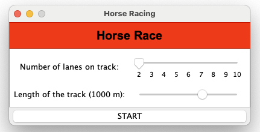
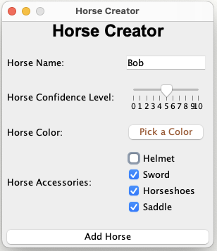
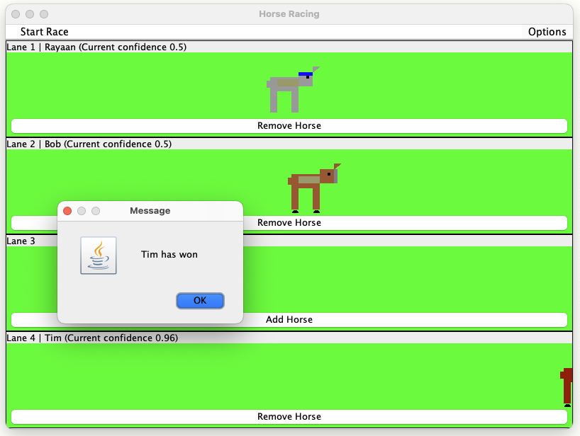
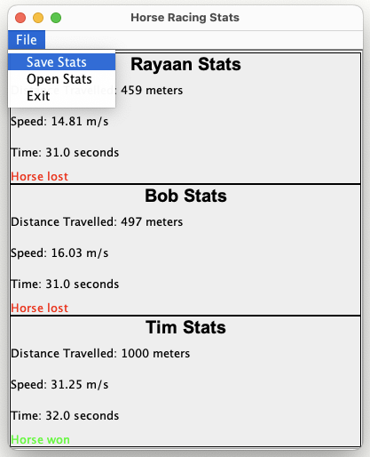

# Horse Race Simulation

This is a simple program which consists of 2 parts. Part 1 consists of a textual based program ran in the console. Part 2 consists of a GUI based program ran in a window. The program simulates a horse race. 

## Part 1: Textual Based Program

Horses are represented by a character. Each horse has a name, confidence level, and symbol. Its distance and its status of it being fallen is also stored within its object. 

A race consists of a maximun number of n horses where n is the number of lanes which is passed as an argument when creating an object of class Race as well as the distance. Not all tracks need to be filled.

You can create a simple race by creating an instance of Race, adding instances of Horse to the race, then calling startRace() method.
```java
Race race = new Race(10, 3);
Horse horse1 = new Horse('A', "HorseA", 0.5);
Horse horse2 = new Horse('B', "HorseB", 0.4);
Horse horse3 = new Horse('C', "HorseC", 0.8);
race.addHorse(horse1, 1);
race.addHorse(horse2, 2);
race.addHorse(horse3, 3);
race.startRace();
```

Each time startRace() is called, the horses are moved back to the start, the confidence level is preserved. When a horse wins a race, its confidence level is increased by 10%. When a horse falls, its confidence level is decreased by 10%.

### How to Run
There is a test program included in part1 directory (**Test.java**), which demonstrates the functionality of the program, which is a interactive program that allows the user to input all the data and repeatedly start a race.

To run the test program in terminal, navigate to the root directory of this project and run the following command:
```bash
javac -d bin Part1/*.java
java -cp bin Test
```

## Part 2: GUI Based Program

The GUI based program is a simple program that allows the user to create a horse race between n number of horses. 

### Features
- Create a race with n number of tracks(between 2 and 10) and a distance between 100 and 1500 meters.
- Add and Remove horses to track lanes (tracks may stay empty).
- Create and customise horses with a name, confidence level, color, accessories and color.
- View a race stats, which shows the distance covered, time taken, and speed of each horse, and shows the winner.
- Save race stats as a file, which you can load/ open later any time.

### Screenshots
{ width=50% }
{ width=50% }
{ width=50% }
{ width=50% }


### Initiation Methods
The program is initiated by creating an instance of StartUI class. This class creates a JFrame window which is used mainly thoughout the program. The StartUI class is responsible for creating the main menu, and the main panel which is used to display options to create the race. It is a skeleton class.
```java
StartUI startUI = new StartUI(null).display();
```

The method ```startRaceGUI()``` is used to initiate the race each time in the program. It belongs to the RaceUI class. This method is private and used after the user supposedly creates the race and adds the horses using the GUI.

### How to Run
The GUI based program is located in the part2 directory. The main class is **StartUI.java**. To run the program, navigate to the root directory of this project and run the following command:
```bash
javac -d bin Part1/Horse.java
javac -d bin Part2/*.java -cp bin
java -cp bin StartUI
```

